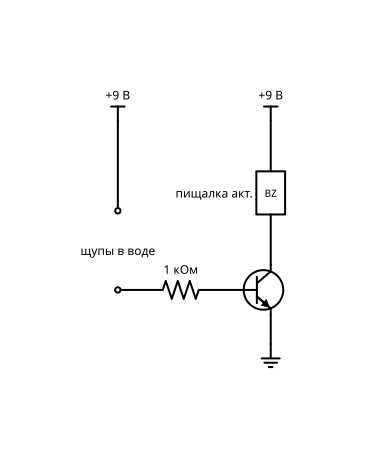

# Уровень 2. Транзисторы

Транзистор как ключ и усилитель, датчики, первые колебания. Микросхем ещё нет.

Схем в разделе: **7**. Уровни сложности: 2.

Общие правила, обозначения и базовый набор (бредборд, перемычки) — в `README.md`.

## Сводная BOM раздела

Максимальное количество каждой детали, нужное для любой одной схемы раздела. Если собирать схемы по очереди и переиспользовать детали, этого набора хватит на весь раздел.

| Кол-во | Компонент |
|---:|---|
| 1 | Батарея 9 В «Крона» + клипса |
| 1 | Резистор 1 кОм |
| 6 | Резистор 10 кОм |
| 2 | Резистор 47 кОм |
| 3 | Резистор 470 Ом |
| 1 | Потенциометр 10 кОм лин. |
| 1 | Потенциометр 100 кОм лин. |
| 1 | Конденсатор керамический 47 нФ |
| 2 | Конденсатор электролитический 47 мкФ |
| 3 | Транзистор NPN BC547 (или 2N3904) |
| 1 | Транзистор PNP BC557 (или 2N3906) |
| 1 | LED белый 5 мм |
| 3 | LED зелёный 5 мм |
| 2 | LED красный 5 мм |
| 2 | Кнопка тактовая 6×6 |
| 1 | Два провода-щупа |
| 1 | Две контактные площадки (перемычки / фольга) |
| 1 | Динамик 8 Ом 0,5 Вт |
| 1 | Пищалка активная 3–12 В |
| 1 | Стакан с водой |
| 1 | Фоторезистор GL5528 |

## Схемы

### 1. Транзисторный ключ

**Сложность:** Уровень 2

**Что это и зачем:** Слабый ток управляет сильным. Основа почти всего дальше.

**Игрок видит:** крошечный ток в базе включает яркий LED или моторчик.

**Принципиальная схема:**

**BOM:**

| Кол-во | Компонент |
|---:|---|
| 1 | Батарея 9 В «Крона» + клипса |
| 1 | Транзистор NPN BC547 (или 2N3904) |
| 1 | Кнопка тактовая 6×6 |
| 1 | Резистор 10 кОм |
| 1 | Резистор 470 Ом |
| 1 | LED красный 5 мм |

### 2. Сумеречный ночник

**Сложность:** Уровень 2

**Что это и зачем:** Фоторезистор и транзистор: темно — свет включается сам.

**Игрок видит:** ползунок «освещённость» в игре, LED включается в темноте.

**Принципиальная схема:**

**BOM:**

| Кол-во | Компонент |
|---:|---|
| 1 | Батарея 9 В «Крона» + клипса |
| 1 | Транзистор NPN BC547 (или 2N3904) |
| 1 | Фоторезистор GL5528 |
| 1 | Потенциометр 10 кОм лин. |
| 1 | Резистор 10 кОм |
| 1 | Резистор 470 Ом |
| 1 | LED белый 5 мм |

### 3. Сенсорная кнопка

**Сложность:** Уровень 2

**Что это и зачем:** Пара Дарлингтона чувствует прикосновение пальца к двум контактам.

**Игрок видит:** касание курсором пластинок зажигает LED.

**Принципиальная схема:**

**BOM:**

| Кол-во | Компонент |
|---:|---|
| 1 | Батарея 9 В «Крона» + клипса |
| 2 | Транзистор NPN BC547 (или 2N3904) |
| 1 | Резистор 1 кОм |
| 1 | Резистор 470 Ом |
| 1 | LED красный 5 мм |
| 1 | Две контактные площадки (перемычки / фольга) |

### 4. Датчик воды

**Сложность:** Уровень 2

**Что это и зачем:** Два проводка в стакане: вода проводит ток, звучит пищалка. Практичная «сигнализация протечки».

**Игрок видит:** анимированный стакан, при заполнении срабатывает писк.

**Принципиальная схема:**

**BOM:**

| Кол-во | Компонент |
|---:|---|
| 1 | Батарея 9 В «Крона» + клипса |
| 1 | Транзистор NPN BC547 (или 2N3904) |
| 1 | Резистор 1 кОм |
| 1 | Пищалка активная 3–12 В |
| 1 | Два провода-щупа |
| 1 | Стакан с водой |

### 5. Мигалка на двух транзисторах

**Сложность:** Уровень 2

**Что это и зачем:** Классический мультивибратор: два LED мигают по очереди без всяких микросхем.

**Игрок видит:** поочерёдное мигание, частота зависит от конденсаторов.

**Принципиальная схема:**

**BOM:**

| Кол-во | Компонент |
|---:|---|
| 1 | Батарея 9 В «Крона» + клипса |
| 2 | Транзистор NPN BC547 (или 2N3904) |
| 2 | Резистор 47 кОм |
| 2 | Резистор 470 Ом |
| 2 | Конденсатор электролитический 47 мкФ |
| 2 | LED красный 5 мм |

### 6. Логика на кнопках и транзисторах

**Сложность:** Уровень 2

**Что это и зачем:** И, ИЛИ, НЕ, собранные из транзисторов. Показывает, из чего сделаны логические микросхемы.

**Игрок видит:** таблицу истинности, которая заполняется по мере нажатий.

**Принципиальная схема:**

**BOM:**

| Кол-во | Компонент |
|---:|---|
| 1 | Батарея 9 В «Крона» + клипса |
| 3 | Транзистор NPN BC547 (или 2N3904) |
| 2 | Кнопка тактовая 6×6 |
| 6 | Резистор 10 кОм |
| 3 | Резистор 470 Ом |
| 3 | LED зелёный 5 мм |

### 7. Простая сирена

**Сложность:** Уровень 2

**Что это и зачем:** Генератор звука на транзисторах с динамиком. Первая схема, которая «звучит», а не светит.

**Игрок видит и слышит:** тон из динамика, меняется потенциометром.

**Принципиальная схема:**

**BOM:**

| Кол-во | Компонент |
|---:|---|
| 1 | Батарея 9 В «Крона» + клипса |
| 1 | Транзистор NPN BC547 (или 2N3904) |
| 1 | Транзистор PNP BC557 (или 2N3906) |
| 1 | Резистор 10 кОм |
| 1 | Потенциометр 100 кОм лин. |
| 1 | Конденсатор керамический 47 нФ |
| 1 | Динамик 8 Ом 0,5 Вт |
