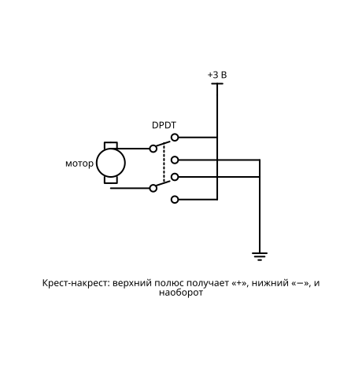
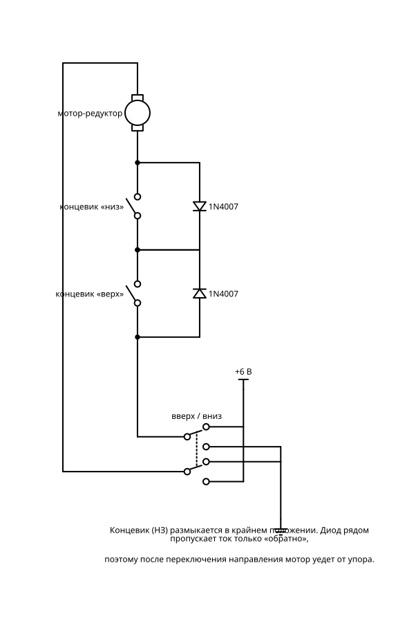

# Моторы и движение

Коллекторные моторы, сервоприводы и шаговики. От вращения по кнопке до робота, который сам ездит по полу. Цвет метки — уровень сложности.

Схем в разделе: **19**. Уровни сложности: 1, 2, 3, 4, 5.

Общие правила, обозначения и базовый набор (бредборд, перемычки) — в `README.md`.

## Сводная BOM раздела

Максимальное количество каждой детали, нужное для любой одной схемы раздела. Если собирать схемы по очереди и переиспользовать детали, этого набора хватит на весь раздел.

| Кол-во | Компонент |
|---:|---|
| 1 | Батарейный отсек 2×AA (3 В) |
| 1 | Батарейный отсек 3×AA (4,5 В) |
| 1 | Батарейный отсек 4×AA (6 В) |
| 1 | Адаптер 9 В 1 А (DC) |
| 1 | Модуль питания 5 В для бредборда (USB / 7805) |
| 1 | Таймер NE555 |
| 2 | CD4011 (4× И-НЕ) |
| 1 | CD4013 (2× D-триггер) |
| 1 | CD4017 (десятичный счётчик) |
| 1 | CD4060 (счётчик с генератором) |
| 1 | CD4069 (6× НЕ) |
| 1 | CD4093 (4× И-НЕ с триггером Шмитта) |
| 4 | CD4511 (дешифратор BCD → 7-сегм.) |
| 2 | CD4518 (2× счётчик BCD) |
| 1 | 74HC194 (реверсивный сдвиговый регистр) |
| 1 | 74HC390 (2× десятичный счётчик) |
| 2 | 74HC85 (4-бит компаратор) |
| 1 | LM339 (4× компаратор) |
| 1 | LM393 (2× компаратор) |
| 1 | Резистор 1 МОм |
| 4 | Резистор 1 кОм |
| 1 | Резистор 10 МОм |
| 16 | Резистор 10 кОм |
| 1 | Резистор 100 кОм |
| 1 | Резистор 2,2 кОм |
| 2 | Резистор 220 Ом |
| 2 | Резистор 220 кОм |
| 1 | Резистор 4,7 кОм |
| 1 | Резистор 47 Ом |
| 28 | Резистор 470 Ом |
| 4 | Потенциометр 10 кОм лин. |
| 1 | Потенциометр 100 кОм лин. |
| 2 | Конденсатор керамический 10 нФ |
| 6 | Конденсатор керамический 100 нФ |
| 1 | Конденсатор керамический 22 пФ |
| 1 | Конденсатор керамический 33 пФ |
| 1 | Конденсатор плёночный 220 нФ |
| 4 | Конденсатор электролитический 10 мкФ |
| 1 | Конденсатор электролитический 100 мкФ |
| 1 | Конденсатор электролитический 4700 мкФ |
| 4 | Диод 1N4007 |
| 2 | Диод 1N4148 |
| 1 | Транзистор NPN BC547 (или 2N3904) |
| 2 | Транзистор NPN BD139 |
| 2 | Транзистор NPN Дарлингтон TIP120 |
| 1 | Транзистор PNP BC557 (или 2N3906) |
| 2 | Транзистор PNP BD140 |
| 2 | MOSFET N-канал IRLZ44N (логический уровень) |
| 1 | LED красный 5 мм |
| 1 | LED самомигающий 5 мм |
| 4 | Индикатор 7-сегментный 0,56″, общий катод |
| 4 | Кнопка тактовая 6×6 |
| 1 | Переключатель DPDT |
| 1 | Переключатель SPDT (тумблер/движковый) |
| 1 | DIP-переключатель 8 поз. |
| 1 | L293D (драйвер двух моторов) |
| 1 | Вентилятор 5 В 40 мм |
| 1 | Вибромотор 3 В |
| 2 | Датчик отражения TCRT5000 |
| 1 | Диск с 60 прорезями |
| 1 | Кабель 4–6 жил 1–2 м для пульта |
| 1 | Кварц 32 768 Гц |
| 2 | Концевой микровыключатель с рычагом |
| 1 | Модель шторки (нить, катушка на валу) |
| 1 | Модуль драйвера ULN2003 |
| 1 | Мотор DC 3–6 В |
| 1 | Мотор-редуктор TT 3–6 В |
| 1 | Основа: головка зубной щётки или пробка |
| 1 | Поворотный диск |
| 1 | Пропеллер/флажок на вал |
| 1 | Ручка или шкив на вал |
| 1 | Сдвоенный таймер NE556 |
| 1 | Сервопривод SG90 |
| 1 | Солнечная панель 5–6 В ~0,5 Вт |
| 1 | Термистор NTC 10 кОм |
| 2 | Фоторезистор GL5528 |
| 1 | Шаговый двигатель 28BYJ-48 5 В |
| 1 | Шасси 2WD с двумя моторами TT и колёсами |
| 1 | Щелевая оптопара (ITR9608 / модуль) |

## Схемы

### 1. Мотор с выключателем

**Что это и зачем:** Батарейка, тумблер, моторчик. Первое, что крутится, а не светится.

**Игрок видит:** вращающийся вал с пропеллером, скорость зависит от батарейки.

**Принципиальная схема:**

**BOM:**

| Кол-во | Компонент |
|---:|---|
| 1 | Батарейный отсек 2×AA (3 В) |
| 1 | Мотор DC 3–6 В |
| 1 | Переключатель SPDT (тумблер/движковый) |
| 1 | Пропеллер/флажок на вал |

### 2. Мотор-генератор

**Сложность:** Уровень 1

**Что это и зачем:** Крутишь вал рукой — загорается LED. Показывает, что мотор и генератор это одно и то же.

**Игрок видит:** чем быстрее тянешь мышью ручку, тем ярче LED.

**Принципиальная схема:**

**BOM:**

| Кол-во | Компонент |
|---:|---|
| 1 | Мотор DC 3–6 В |
| 1 | LED красный 5 мм |
| 1 | Резистор 47 Ом |
| 1 | Ручка или шкив на вал |

### 3. Реверс переключателем

**Сложность:** Уровень 1

**Что это и зачем:** Двухполюсный тумблер меняет полярность и направление вращения.

**Игрок видит:** стрелку направления на валу, которая разворачивается.

**Принципиальная схема:**

**BOM:**

| Кол-во | Компонент |
|---:|---|
| 1 | Батарейный отсек 2×AA (3 В) |
| 1 | Мотор DC 3–6 В |
| 1 | Переключатель DPDT |

### 4. Мотор через транзистор

**Сложность:** Уровень 2

**Что это и зачем:** Кнопка управляет мотором через ключ, а защитный диод гасит выброс. Без диода транзистор сгорает.

**Игрок видит:** всплеск напряжения на осциллографе и сгоревший транзистор, если диода нет.

**Заметка для реализации:** Для урока «без диода» — запасной транзистор, в игре он сгорает.

**Принципиальная схема:**

**BOM:**

| Кол-во | Компонент |
|---:|---|
| 1 | Батарейный отсек 3×AA (4,5 В) |
| 1 | Транзистор NPN Дарлингтон TIP120 |
| 1 | Резистор 1 кОм |
| 1 | Диод 1N4007 |
| 1 | Кнопка тактовая 6×6 |
| 1 | Мотор DC 3–6 В |

### 5. Вибробот

**Сложность:** Уровень 2

**Что это и зачем:** Мотор с грузиком на валу трясёт корпус из зубной щётки, и тот ползёт сам.

**Игрок видит:** жучка, который хаотично бегает по столу.

**Принципиальная схема:**

**BOM:**

| Кол-во | Компонент |
|---:|---|
| 1 | Батарейный отсек 2×AA (3 В) |
| 1 | Вибромотор 3 В |
| 1 | Переключатель SPDT (тумблер/движковый) |
| 1 | Основа: головка зубной щётки или пробка |

### 6. Регулятор скорости на 555

**Сложность:** Уровень 3

**Что это и зачем:** ШИМ: мотор включается и выключается тысячи раз в секунду, ручка меняет долю времени «вкл».

**Игрок видит:** скорость вала и прямоугольные импульсы разной ширины.

**Принципиальная схема:**

**BOM:**

| Кол-во | Компонент |
|---:|---|
| 1 | Батарейный отсек 4×AA (6 В) |
| 1 | Таймер NE555 |
| 1 | Потенциометр 100 кОм лин. |
| 2 | Диод 1N4148 |
| 1 | Резистор 1 кОм |
| 1 | Конденсатор керамический 10 нФ |
| 1 | Конденсатор керамический 100 нФ |
| 1 | MOSFET N-канал IRLZ44N (логический уровень) |
| 1 | Диод 1N4007 |
| 1 | Мотор DC 3–6 В |

### 7. Сервопривод без контроллера

**Сложность:** Уровень 3

**Что это и зачем:** 555 выдаёт импульсы нужной длины, потенциометр задаёт угол сервы от 0 до 180°.

**Игрок видит:** качалку сервы, которая повторяет поворот ручки.

**Заметка для реализации:** 555 даёт период ~18 мс с коротким «нулём» 0,7–2,2 мс (задаётся 4,7 кОм + 10 кОм), транзистор инвертирует его в положительный импульс для сервы.

**Принципиальная схема:**

**BOM:**

| Кол-во | Компонент |
|---:|---|
| 1 | Батарейный отсек 3×AA (4,5 В) |
| 1 | Таймер NE555 |
| 1 | Транзистор NPN BC547 (или 2N3904) |
| 1 | Резистор 100 кОм |
| 1 | Резистор 4,7 кОм |
| 1 | Потенциометр 10 кОм лин. |
| 2 | Резистор 10 кОм |
| 1 | Конденсатор плёночный 220 нФ |
| 1 | Конденсатор керамический 10 нФ |
| 1 | Конденсатор электролитический 100 мкФ |
| 1 | Сервопривод SG90 |

### 8. Вентилятор с термостатом

**Сложность:** Уровень 3

**Что это и зачем:** Компаратор и термистор: стало жарко — вентилятор включился. Для корпуса с электроникой или 3D-принтера.

**Игрок видит:** термометр и вентилятор, который включается на пороге.

**Принципиальная схема:**

**BOM:**

| Кол-во | Компонент |
|---:|---|
| 1 | Модуль питания 5 В для бредборда (USB / 7805) |
| 1 | LM393 (2× компаратор) |
| 1 | Термистор NTC 10 кОм |
| 2 | Резистор 10 кОм |
| 1 | Потенциометр 10 кОм лин. |
| 1 | Резистор 1 МОм |
| 1 | MOSFET N-канал IRLZ44N (логический уровень) |
| 1 | Диод 1N4007 |
| 1 | Вентилятор 5 В 40 мм |

### 9. Шторка с концевиками

**Сложность:** Уровень 3

**Что это и зачем:** Кнопка запускает мотор, концевой выключатель сам останавливает его в крайнем положении.

**Игрок видит:** занавеску, которая доезжает до края и замирает.

**Заметка для реализации:** Классическая схема без логики: концевик размыкает цепь, диод параллельно концевику даёт уехать обратно.

**Принципиальная схема:**

**BOM:**

| Кол-во | Компонент |
|---:|---|
| 1 | Батарейный отсек 4×AA (6 В) |
| 1 | Мотор-редуктор TT 3–6 В |
| 1 | Переключатель DPDT |
| 2 | Концевой микровыключатель с рычагом |
| 2 | Диод 1N4007 |
| 1 | Модель шторки (нить, катушка на валу) |

### 10. H-мост на транзисторах

**Сложность:** Уровень 4

**Что это и зачем:** Четыре транзистора: вперёд, назад и тормоз двумя кнопками. Главное — не открыть оба плеча сразу.

**Игрок видит:** ток в плечах моста и короткое замыкание, если нажать не то.

**Заметка для реализации:** Каждая половина — комплементарная пара с общей базой (инвертор). Отпущены обе кнопки или нажаты обе — мотор стоит, сквозного тока нет.

**Принципиальная схема:**

**BOM:**

| Кол-во | Компонент |
|---:|---|
| 1 | Батарейный отсек 4×AA (6 В) |
| 2 | Транзистор NPN BD139 |
| 2 | Транзистор PNP BD140 |
| 4 | Диод 1N4007 |
| 4 | Резистор 1 кОм |
| 2 | Резистор 10 кОм |
| 2 | Кнопка тактовая 6×6 |
| 1 | Мотор DC 3–6 В |

### 11. Тележка на L293D

**Сложность:** Уровень 4

**Что это и зачем:** Готовый драйвер на два мотора и четыре кнопки: пульт на проводе для игрушечной машинки.

**Игрок видит:** тележку на арене, которой управляет кнопками своей схемы.

**Принципиальная схема:**

**BOM:**

| Кол-во | Компонент |
|---:|---|
| 1 | Батарейный отсек 4×AA (6 В) |
| 1 | L293D (драйвер двух моторов) |
| 1 | Шасси 2WD с двумя моторами TT и колёсами |
| 4 | Кнопка тактовая 6×6 |
| 4 | Резистор 10 кОм |
| 1 | Конденсатор керамический 100 нФ |
| 1 | Конденсатор электролитический 100 мкФ |
| 1 | Кабель 4–6 жил 1–2 м для пульта |

### 12. Шаговый двигатель

**Сложность:** Уровень 4

**Что это и зачем:** 555 даёт такты, счётчик и ULN2003 по очереди включают обмотки. Вал поворачивается точными шагами.

**Игрок видит:** подсветку активной обмотки и вал, щёлкающий по шагам.

**Заметка для реализации:** CD4017 со сбросом по Q4 даёт четырёхфазную волновую коммутацию.

**Принципиальная схема:**

**BOM:**

| Кол-во | Компонент |
|---:|---|
| 1 | Модуль питания 5 В для бредборда (USB / 7805) |
| 1 | Таймер NE555 |
| 1 | CD4017 (десятичный счётчик) |
| 1 | Модуль драйвера ULN2003 |
| 1 | Шаговый двигатель 28BYJ-48 5 В |
| 1 | Потенциометр 100 кОм лин. |
| 1 | Резистор 10 кОм |
| 1 | Конденсатор электролитический 10 мкФ |
| 1 | Конденсатор керамический 10 нФ |

### 13. Робот-светолюб

**Сложность:** Уровень 4

**Что это и зачем:** Два фоторезистора управляют двумя моторами крест-накрест, и робот едет на свет фонарика.

**Игрок видит:** робота, который гонится за пятном света от курсора.

**Принципиальная схема:**

**BOM:**

| Кол-во | Компонент |
|---:|---|
| 1 | Батарейный отсек 4×AA (6 В) |
| 1 | Шасси 2WD с двумя моторами TT и колёсами |
| 2 | Фоторезистор GL5528 |
| 2 | Потенциометр 10 кОм лин. |
| 2 | Транзистор NPN Дарлингтон TIP120 |
| 2 | Диод 1N4007 |
| 2 | Резистор 1 кОм |

### 14. Робот по линии

**Сложность:** Уровень 4

**Что это и зачем:** Два датчика отражения держат робота на чёрной линии. Чистая аналоговая логика, без кода.

**Игрок видит:** трассу, по которой робот едет сам; можно рисовать свои трассы.

**Принципиальная схема:**

**BOM:**

| Кол-во | Компонент |
|---:|---|
| 1 | Батарейный отсек 4×AA (6 В) |
| 1 | Шасси 2WD с двумя моторами TT и колёсами |
| 2 | Датчик отражения TCRT5000 |
| 2 | Резистор 220 Ом |
| 4 | Резистор 10 кОм |
| 2 | Потенциометр 10 кОм лин. |
| 1 | LM393 (2× компаратор) |
| 2 | MOSFET N-канал IRLZ44N (логический уровень) |
| 2 | Диод 1N4007 |

### 15. Солнечный двигатель

**Сложность:** Уровень 4

**Что это и зачем:** Схема BEAM копит энергию от маленькой солнечной панели в конденсаторе и отдаёт мотору рывком.

**Игрок видит:** шкалу заряда и толчок мотора, когда она заполняется.

**Заметка для реализации:** Схема BEAM «FLED solar engine». Мотор лучше взять маловаттный (пейджерный или от CD-привода).

**Принципиальная схема:**

**BOM:**

| Кол-во | Компонент |
|---:|---|
| 1 | Солнечная панель 5–6 В ~0,5 Вт |
| 1 | Конденсатор электролитический 4700 мкФ |
| 1 | LED самомигающий 5 мм |
| 1 | Транзистор NPN BC547 (или 2N3904) |
| 1 | Транзистор PNP BC557 (или 2N3906) |
| 1 | Резистор 2,2 кОм |
| 1 | Мотор DC 3–6 В |

### 16. Робот с бампером

**Сложность:** Уровень 5

**Что это и зачем:** Упёрся в стену — одновибратор включает задний ход и поворот на пару секунд, потом снова вперёд.

**Игрок видит:** робота, который сам выбирается из лабиринта комнаты.

**Принципиальная схема:**

**BOM:**

| Кол-во | Компонент |
|---:|---|
| 1 | Батарейный отсек 4×AA (6 В) |
| 1 | Шасси 2WD с двумя моторами TT и колёсами |
| 1 | L293D (драйвер двух моторов) |
| 1 | Сдвоенный таймер NE556 |
| 1 | CD4069 (6× НЕ) |
| 2 | Концевой микровыключатель с рычагом |
| 2 | Резистор 10 кОм |
| 2 | Резистор 220 кОм |
| 2 | Конденсатор электролитический 10 мкФ |
| 2 | Конденсатор керамический 10 нФ |
| 2 | Конденсатор керамический 100 нФ |

### 17. Поворотный стол

**Сложность:** Уровень 5

**Что это и зачем:** Шаговик с регулировкой скорости, направления и остановкой через заданное число шагов. Для съёмки предметов по кругу.

**Игрок видит:** предмет на столике и счётчик шагов на индикаторе.

**Заметка для реализации:** 74HC194 гоняет «бегущую единицу» в обе стороны — это и есть реверс шаговика. Остановка — по совпадению счётчика шагов с DIP.

**Принципиальная схема:**

**BOM:**

| Кол-во | Компонент |
|---:|---|
| 1 | Модуль питания 5 В для бредборда (USB / 7805) |
| 1 | Таймер NE555 |
| 1 | 74HC194 (реверсивный сдвиговый регистр) |
| 1 | Модуль драйвера ULN2003 |
| 1 | Шаговый двигатель 28BYJ-48 5 В |
| 1 | 74HC390 (2× десятичный счётчик) |
| 2 | 74HC85 (4-бит компаратор) |
| 1 | DIP-переключатель 8 поз. |
| 2 | CD4511 (дешифратор BCD → 7-сегм.) |
| 2 | Индикатор 7-сегментный 0,56″, общий катод |
| 14 | Резистор 470 Ом |
| 1 | Переключатель SPDT (тумблер/движковый) |
| 2 | Кнопка тактовая 6×6 |
| 1 | Потенциометр 100 кОм лин. |
| 12 | Резистор 10 кОм |
| 1 | Конденсатор электролитический 10 мкФ |
| 1 | Конденсатор керамический 10 нФ |
| 6 | Конденсатор керамический 100 нФ |
| 1 | Поворотный диск |

### 18. Тахометр

**Сложность:** Уровень 5

**Что это и зачем:** Оптопара считает обороты через прорезь на диске, счётчики показывают обороты в минуту.

**Игрок видит:** цифры на индикаторе, которые меняются вместе со скоростью мотора.

**Заметка для реализации:** 60 прорезей и окно 1 с дают сразу обороты в минуту.

**Принципиальная схема:**

**BOM:**

| Кол-во | Компонент |
|---:|---|
| 1 | Адаптер 9 В 1 А (DC) |
| 1 | Мотор DC 3–6 В |
| 1 | Щелевая оптопара (ITR9608 / модуль) |
| 1 | Резистор 220 Ом |
| 1 | Резистор 10 кОм |
| 1 | CD4093 (4× И-НЕ с триггером Шмитта) |
| 1 | Кварц 32 768 Гц |
| 1 | Конденсатор керамический 22 пФ |
| 1 | Конденсатор керамический 33 пФ |
| 1 | Резистор 10 МОм |
| 1 | CD4060 (счётчик с генератором) |
| 1 | CD4013 (2× D-триггер) |
| 2 | CD4518 (2× счётчик BCD) |
| 4 | CD4511 (дешифратор BCD → 7-сегм.) |
| 4 | Индикатор 7-сегментный 0,56″, общий катод |
| 28 | Резистор 470 Ом |
| 6 | Конденсатор керамический 100 нФ |
| 1 | Диск с 60 прорезями |

### 19. Автономный робот

**Сложность:** Уровень 5, финальный проект

**Что это и зачем:** Собирает всё вместе: едет по линии, объезжает препятствия бампером, при потере линии ищет свет. Режимы переключаются логикой.

**Игрок видит:** робота на сложной арене и может устраивать заезды на время.

**Заметка для реализации:** Ориентировочный состав: приоритет «бампер > линия > свет» реализуется на CD4011.

**Принципиальная схема:**

**BOM:**

| Кол-во | Компонент |
|---:|---|
| 1 | Батарейный отсек 4×AA (6 В) |
| 1 | Шасси 2WD с двумя моторами TT и колёсами |
| 2 | Датчик отражения TCRT5000 |
| 2 | Фоторезистор GL5528 |
| 2 | Концевой микровыключатель с рычагом |
| 1 | LM339 (4× компаратор) |
| 1 | L293D (драйвер двух моторов) |
| 1 | Сдвоенный таймер NE556 |
| 2 | CD4011 (4× И-НЕ) |
| 1 | CD4013 (2× D-триггер) |
| 16 | Резистор 10 кОм |
| 4 | Потенциометр 10 кОм лин. |
| 2 | Резистор 220 Ом |
| 4 | Конденсатор электролитический 10 мкФ |
| 6 | Конденсатор керамический 100 нФ |
