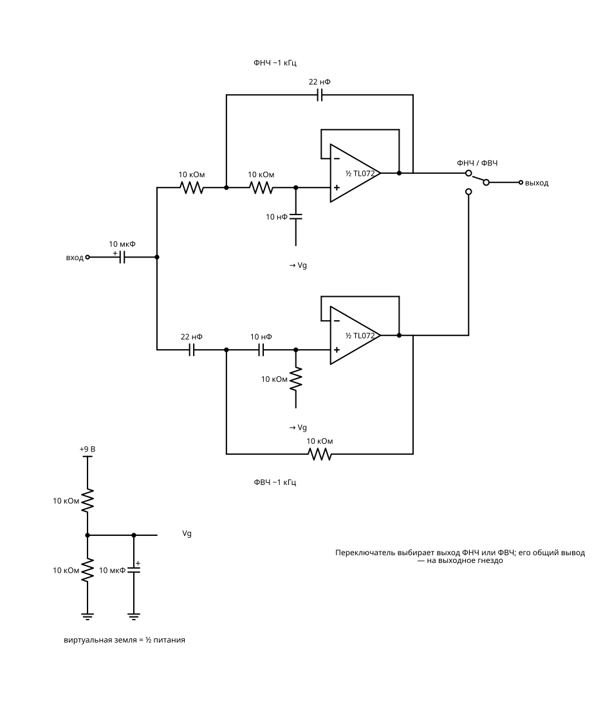

# Операционные усилители

Универсальный аналоговый кирпичик: усиливает, фильтрует, генерирует, сравнивает.

Схем в разделе: **8**. Уровни сложности: 3, 4, 5.

Общие правила, обозначения и базовый набор (бредборд, перемычки) — в `README.md`.

## Сводная BOM раздела

Максимальное количество каждой детали, нужное для любой одной схемы раздела. Если собирать схемы по очереди и переиспользовать детали, этого набора хватит на весь раздел.

| Кол-во | Компонент |
|---:|---|
| 1 | Батарея 9 В «Крона» + клипса |
| 1 | Адаптер 9 В 1 А (DC) |
| 1 | CD4001 (4× ИЛИ-НЕ) |
| 1 | LM358 (2× ОУ) |
| 1 | LM393 (2× компаратор) |
| 1 | TL072 (2× ОУ) |
| 2 | TL074 (4× ОУ) |
| 10 | Резистор 10 кОм |
| 2 | Резистор 100 кОм |
| 1 | Резистор 2,2 кОм |
| 1 | Резистор 22 кОм |
| 1 | Резистор 4,7 кОм |
| 3 | Резистор 470 Ом |
| 3 | Потенциометр 10 кОм лин. |
| 1 | Потенциометр 100 кОм лин. |
| 2 | Подстроечный резистор 10 кОм |
| 1 | Конденсатор керамический 1 нФ |
| 2 | Конденсатор керамический 10 нФ |
| 2 | Конденсатор керамический 100 нФ |
| 2 | Конденсатор керамический 22 нФ |
| 1 | Конденсатор электролитический 1 мкФ |
| 3 | Конденсатор электролитический 10 мкФ |
| 4 | Диод 1N4148 |
| 1 | LED зелёный 5 мм |
| 1 | LED красный 5 мм |
| 1 | LED синий 5 мм |
| 1 | Переключатель SPDT (тумблер/движковый) |
| 1 | Галетный переключатель 1×4 |
| 2 | Гнездо 3,5 мм на плате-переходнике |
| 1 | Термистор NTC 10 кОм |
| 1 | Электретный микрофон |

## Схемы

### 1. Усилитель в 10 раз

**Что это и зачем:** Два резистора задают усиление. Главная формула аналоговой электроники на одном примере.

**Игрок видит:** маленькую и большую синусоиду рядом.

**Заметка для реализации:** Инвертирующая схема 100k/10k, виртуальная земля делителем 10k/10k. Источник сигнала — генератор в игре.

**Принципиальная схема:**

**BOM:**

| Кол-во | Компонент |
|---:|---|
| 1 | Батарея 9 В «Крона» + клипса |
| 1 | LM358 (2× ОУ) |
| 3 | Резистор 10 кОм |
| 1 | Резистор 100 кОм |
| 1 | Конденсатор электролитический 10 мкФ |
| 1 | Конденсатор керамический 100 нФ |

### 2. Микрофонный предусилитель

**Сложность:** Уровень 3

**Что это и зачем:** Делает из слабого сигнала микрофона уровень, который можно подать на усилитель или шкалу.

**Игрок видит:** как голос превращается в заметный сигнал.

**Принципиальная схема:**

**BOM:**

| Кол-во | Компонент |
|---:|---|
| 1 | Батарея 9 В «Крона» + клипса |
| 1 | Электретный микрофон |
| 1 | Резистор 2,2 кОм |
| 1 | LM358 (2× ОУ) |
| 3 | Резистор 10 кОм |
| 1 | Резистор 100 кОм |
| 2 | Конденсатор электролитический 10 мкФ |
| 1 | Конденсатор керамический 100 нФ |

### 3. Оконный компаратор

**Сложность:** Уровень 3

**Что это и зачем:** Два порога: «холодно», «норма», «жарко». Три LED вместо одного.

**Игрок видит:** термометр с тремя зонами.

**Принципиальная схема:**

**BOM:**

| Кол-во | Компонент |
|---:|---|
| 1 | Батарея 9 В «Крона» + клипса |
| 1 | LM393 (2× компаратор) |
| 1 | Термистор NTC 10 кОм |
| 3 | Резистор 10 кОм |
| 2 | Подстроечный резистор 10 кОм |
| 1 | CD4001 (4× ИЛИ-НЕ) |
| 1 | LED синий 5 мм |
| 1 | LED зелёный 5 мм |
| 1 | LED красный 5 мм |
| 3 | Резистор 470 Ом |

### 4. Активный фильтр

**Сложность:** Уровень 4

**Что это и зачем:** Отрезает басы или верха. Основа эквалайзеров и сабвуферов.

**Игрок слышит:** музыку «из-за стены» или «из телефона».

**Заметка для реализации:** Саллен-Ки второго порядка, срез ~1 кГц, переключатель ФНЧ/ФВЧ.

**Принципиальная схема:**

**BOM:**

| Кол-во | Компонент |
|---:|---|
| 1 | Батарея 9 В «Крона» + клипса |
| 1 | TL072 (2× ОУ) |
| 6 | Резистор 10 кОм |
| 2 | Конденсатор керамический 10 нФ |
| 2 | Конденсатор керамический 22 нФ |
| 1 | Переключатель SPDT (тумблер/движковый) |
| 2 | Конденсатор электролитический 10 мкФ |
| 2 | Гнездо 3,5 мм на плате-переходнике |

### 5. Генератор синуса

**Сложность:** Уровень 4

**Что это и зачем:** Мост Вина даёт чистый тон без гудения, как у камертона.

**Игрок видит и слышит:** ровную синусоиду и мягкий звук.

**Заметка для реализации:** Мост Вина ~1,6 кГц, амплитуда стабилизируется встречными диодами.

**Принципиальная схема:**

**BOM:**

| Кол-во | Компонент |
|---:|---|
| 1 | Батарея 9 В «Крона» + клипса |
| 1 | TL072 (2× ОУ) |
| 5 | Резистор 10 кОм |
| 2 | Конденсатор керамический 10 нФ |
| 1 | Резистор 22 кОм |
| 1 | Подстроечный резистор 10 кОм |
| 2 | Диод 1N4148 |
| 1 | Резистор 4,7 кОм |
| 1 | Конденсатор электролитический 10 мкФ |

### 6. Интегратор

**Сложность:** Уровень 4

**Что это и зачем:** Из прямоугольника делает треугольник: накапливает сигнал во времени.

**Игрок видит:** две формы сигнала на осциллографе.

**Принципиальная схема:**

**BOM:**

| Кол-во | Компонент |
|---:|---|
| 1 | Батарея 9 В «Крона» + клипса |
| 1 | TL072 (2× ОУ) |
| 4 | Резистор 10 кОм |
| 1 | Резистор 100 кОм |
| 1 | Конденсатор керамический 100 нФ |
| 1 | Конденсатор электролитический 10 мкФ |

### 7. Эквалайзер на три полосы

**Сложность:** Уровень 5

**Что это и зачем:** Басы, середина и верха, каждая полоса со своей ручкой.

**Игрок слышит:** как меняется характер одной и той же мелодии.

**Принципиальная схема:**

**BOM:**

| Кол-во | Компонент |
|---:|---|
| 1 | Адаптер 9 В 1 А (DC) |
| 2 | TL074 (4× ОУ) |
| 3 | Потенциометр 10 кОм лин. |
| 10 | Резистор 10 кОм |
| 2 | Конденсатор керамический 100 нФ |
| 2 | Конденсатор керамический 10 нФ |
| 2 | Конденсатор керамический 22 нФ |
| 3 | Конденсатор электролитический 10 мкФ |
| 2 | Гнездо 3,5 мм на плате-переходнике |

### 8. Функциональный генератор

**Сложность:** Уровень 5, финальный проект

**Что это и зачем:** Прямоугольник, треугольник и синус с регулировкой частоты. После сборки становится прибором мастерской.

**Игрок видит:** переключатель форм и сигнал, который можно подать в любую схему.

**Заметка для реализации:** Триггер Шмитта + интегратор дают прямоугольник и треугольник, диодный формирователь — синус.

**Принципиальная схема:**

**BOM:**

| Кол-во | Компонент |
|---:|---|
| 1 | Адаптер 9 В 1 А (DC) |
| 1 | TL074 (4× ОУ) |
| 1 | Галетный переключатель 1×4 |
| 1 | Конденсатор керамический 1 нФ |
| 1 | Конденсатор керамический 10 нФ |
| 1 | Конденсатор керамический 100 нФ |
| 1 | Конденсатор электролитический 1 мкФ |
| 1 | Потенциометр 100 кОм лин. |
| 1 | Потенциометр 10 кОм лин. |
| 4 | Диод 1N4148 |
| 8 | Резистор 10 кОм |
| 2 | Резистор 100 кОм |
| 1 | Резистор 4,7 кОм |
| 2 | Конденсатор электролитический 10 мкФ |
| 1 | Переключатель SPDT (тумблер/движковый) |
| 1 | Гнездо 3,5 мм на плате-переходнике |
