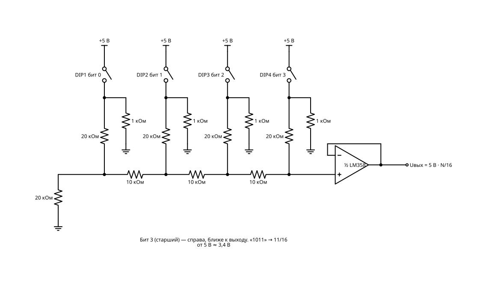

# Цифра ↔ аналог

Мост между нулями-единицами и плавным напряжением. Без этого не было бы ни звука в компьютере, ни цифровых приборов.

Схем в разделе: **7**. Уровни сложности: 3, 4, 5.

Общие правила, обозначения и базовый набор (бредборд, перемычки) — в `README.md`.

## Сводная BOM раздела

Максимальное количество каждой детали, нужное для любой одной схемы раздела. Если собирать схемы по очереди и переиспользовать детали, этого набора хватит на весь раздел.

| Кол-во | Компонент |
|---:|---|
| 1 | Батарея 9 В «Крона» + клипса |
| 1 | Модуль питания 5 В для бредборда (USB / 7805) |
| 1 | Таймер NE555 |
| 1 | 74HC154 (дешифратор 4→16) |
| 1 | 74HC393 (2× 4-бит счётчик) |
| 1 | LM358 (2× ОУ) |
| 1 | LM386 (усилитель мощности) |
| 1 | Резистор 1 МОм |
| 4 | Резистор 1 кОм |
| 7 | Резистор 10 кОм |
| 1 | Резистор 100 кОм |
| 5 | Резистор 20 кОм |
| 1 | Резистор 22 кОм |
| 8 | Резистор 330 Ом |
| 1 | Резистор 47 кОм |
| 1 | Потенциометр 10 кОм лин. |
| 1 | Потенциометр 100 кОм лин. |
| 1 | Подстроечный резистор 1 кОм |
| 1 | Конденсатор керамический 10 нФ |
| 3 | Конденсатор керамический 100 нФ |
| 1 | Конденсатор керамический 100 пФ |
| 1 | Конденсатор керамический 150 пФ |
| 1 | Конденсатор керамический 220 нФ |
| 1 | Конденсатор керамический 470 нФ |
| 2 | Конденсатор электролитический 10 мкФ |
| 1 | Конденсатор электролитический 220 мкФ |
| 64 | Диод 1N4148 |
| 8 | LED жёлтый 5 мм |
| 8 | LED красный 5 мм |
| 4 | Индикатор 7-сегментный 0,56″, общий анод |
| 1 | Кнопка тактовая 6×6 |
| 1 | ADC0804 (8-бит АЦП) |
| 1 | DIP-переключатель 4 поз. |
| 1 | ICL7107 (АЦП + драйвер 3½ разряда) |
| 1 | ICL7660 (инвертор напряжения) |
| 1 | Динамик 8 Ом 0,5 Вт |
| 1 | Пищалка пассивная (пьезо) |
| 1 | Фоторезистор GL5528 |

## Схемы

### 1. ЦАП на резисторах

**Сложность:** Уровень 3

**Что это и зачем:** Лесенка R-2R и четыре переключателя: двоичное число становится напряжением.

**Игрок видит:** «1011» на переключателях и 11 ступенек на вольтметре.

**Заметка для реализации:** DIP подаёт на бит +5 В; резистор 1 кОм держит «0», когда контакт разомкнут (ошибка лесенки при этом ~5 %). ОУ — повторитель, чтобы нагрузка не искажала напряжение.

**Принципиальная схема:**

**BOM:**

| Кол-во | Компонент |
|---:|---|
| 1 | Модуль питания 5 В для бредборда (USB / 7805) |
| 1 | DIP-переключатель 4 поз. |
| 4 | Резистор 1 кОм |
| 5 | Резистор 20 кОм |
| 3 | Резистор 10 кОм |
| 1 | LM358 (2× ОУ) |

### 2. ШИМ в напряжение

**Сложность:** Уровень 3

**Что это и зачем:** RC-фильтр сглаживает импульсы 555 в ровное напряжение, зависящее от ширины импульса.

**Игрок видит:** импульсы на входе и плавную линию на выходе.

**Принципиальная схема:**

**BOM:**

| Кол-во | Компонент |
|---:|---|
| 1 | Батарея 9 В «Крона» + клипса |
| 1 | Таймер NE555 |
| 1 | Потенциометр 100 кОм лин. |
| 2 | Диод 1N4148 |
| 1 | Резистор 1 кОм |
| 1 | Конденсатор керамический 10 нФ |
| 1 | Резистор 10 кОм |
| 1 | Конденсатор электролитический 10 мкФ |

### 3. Генератор пилы и ступенек

**Сложность:** Уровень 4

**Что это и зачем:** Счётчик гоняет ЦАП по кругу: получается пилообразный сигнал.

**Игрок видит и слышит:** лесенку на осциллографе и жужжащий звук.

**Принципиальная схема:**

**BOM:**

| Кол-во | Компонент |
|---:|---|
| 1 | Модуль питания 5 В для бредборда (USB / 7805) |
| 1 | Таймер NE555 |
| 1 | 74HC393 (2× 4-бит счётчик) |
| 5 | Резистор 20 кОм |
| 5 | Резистор 10 кОм |
| 1 | Потенциометр 100 кОм лин. |
| 1 | Конденсатор керамический 10 нФ |
| 1 | Конденсатор электролитический 10 мкФ |
| 1 | LM358 (2× ОУ) |
| 1 | Пищалка пассивная (пьезо) |
| 1 | Конденсатор керамический 100 нФ |

### 4. АЦП на восемь LED

**Сложность:** Уровень 4

**Что это и зачем:** ADC0804 работает без кода: покрутил потенциометр — LED показывают число от 0 до 255.

**Игрок видит:** двоичное число, которое меняется вместе с ручкой.

**Заметка для реализации:** Режим непрерывного преобразования: /WR соединён с /INTR, кнопка запускает первое преобразование.

**Принципиальная схема:**

**BOM:**

| Кол-во | Компонент |
|---:|---|
| 1 | Модуль питания 5 В для бредборда (USB / 7805) |
| 1 | ADC0804 (8-бит АЦП) |
| 1 | Потенциометр 10 кОм лин. |
| 2 | Резистор 10 кОм |
| 1 | Конденсатор керамический 150 пФ |
| 1 | Кнопка тактовая 6×6 |
| 8 | LED красный 5 мм |
| 8 | Резистор 330 Ом |
| 1 | Конденсатор керамический 100 нФ |

### 5. Цифровой люксметр

**Сложность:** Уровень 4

**Что это и зачем:** Фоторезистор и АЦП: освещённость числом на LED или индикаторе.

**Игрок видит:** цифры меняются при движении «лампы».

**Принципиальная схема:**

**BOM:**

| Кол-во | Компонент |
|---:|---|
| 1 | Модуль питания 5 В для бредборда (USB / 7805) |
| 1 | ADC0804 (8-бит АЦП) |
| 1 | Фоторезистор GL5528 |
| 2 | Резистор 10 кОм |
| 1 | Конденсатор керамический 150 пФ |
| 1 | Кнопка тактовая 6×6 |
| 8 | LED жёлтый 5 мм |
| 8 | Резистор 330 Ом |
| 1 | Конденсатор керамический 100 нФ |

### 6. Цифровой вольтметр

**Сложность:** Уровень 5

**Что это и зачем:** ICL7107 сам ведёт индикаторы на 3½ разряда. Настоящий прибор без единой строчки кода.

**Игрок видит:** «4.87» на табло при измерении батарейки.

**Заметка для реализации:** ICL7107 требует ±5 В: отрицательное плечо даёт ICL7660. Индикаторы с общим анодом.

**Принципиальная схема:**

**BOM:**

| Кол-во | Компонент |
|---:|---|
| 1 | Модуль питания 5 В для бредборда (USB / 7805) |
| 1 | ICL7107 (АЦП + драйвер 3½ разряда) |
| 1 | ICL7660 (инвертор напряжения) |
| 2 | Конденсатор электролитический 10 мкФ |
| 4 | Индикатор 7-сегментный 0,56″, общий анод |
| 1 | Резистор 100 кОм |
| 1 | Конденсатор керамический 100 пФ |
| 1 | Резистор 47 кОм |
| 1 | Конденсатор керамический 220 нФ |
| 1 | Конденсатор керамический 470 нФ |
| 1 | Подстроечный резистор 1 кОм |
| 1 | Резистор 22 кОм |
| 1 | Резистор 1 МОм |
| 1 | Конденсатор керамический 10 нФ |
| 1 | Конденсатор керамический 100 нФ |

### 7. Синтез формы из диодного ПЗУ

**Сложность:** Уровень 5, финальный проект

**Что это и зачем:** Счётчик перебирает адреса, диодная матрица хранит отсчёты синуса, ЦАП выдаёт волну. Форму меняешь, переставляя диоды.

**Игрок видит и слышит:** собственную форму волны и её звучание.

**Заметка для реализации:** 16 отсчётов по 4 бита. Диод в пересечении строки адреса и столбца бита = «1».

**Принципиальная схема:**

**BOM:**

| Кол-во | Компонент |
|---:|---|
| 1 | Модуль питания 5 В для бредборда (USB / 7805) |
| 1 | Таймер NE555 |
| 1 | 74HC393 (2× 4-бит счётчик) |
| 1 | 74HC154 (дешифратор 4→16) |
| 64 | Диод 1N4148 |
| 7 | Резистор 10 кОм |
| 5 | Резистор 20 кОм |
| 1 | LM358 (2× ОУ) |
| 1 | LM386 (усилитель мощности) |
| 1 | Конденсатор электролитический 220 мкФ |
| 1 | Конденсатор электролитический 10 мкФ |
| 1 | Конденсатор керамический 10 нФ |
| 1 | Потенциометр 100 кОм лин. |
| 1 | Динамик 8 Ом 0,5 Вт |
| 3 | Конденсатор керамический 100 нФ |
