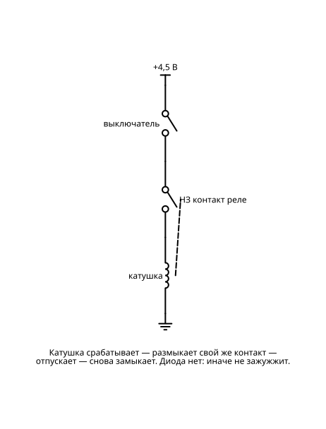

# Релейная логика

Логика, которую слышно. Так работали первые компьютеры и до сих пор работают станки и лифты.

Схем в разделе: **7**. Уровни сложности: 2, 3, 4, 5.

Общие правила, обозначения и базовый набор (бредборд, перемычки) — в `README.md`.

## Сводная BOM раздела

Максимальное количество каждой детали, нужное для любой одной схемы раздела. Если собирать схемы по очереди и переиспользовать детали, этого набора хватит на весь раздел.

| Кол-во | Компонент |
|---:|---|
| 1 | Батарейный отсек 3×AA (4,5 В) |
| 1 | Батарея 9 В «Крона» + клипса |
| 1 | Модуль питания 5 В для бредборда (USB / 7805) |
| 5 | Резистор 220 Ом |
| 1 | Резистор 470 Ом |
| 3 | Конденсатор электролитический 470 мкФ |
| 18 | Диод 1N4007 |
| 1 | LED белый 5 мм |
| 5 | LED красный 5 мм |
| 1 | Кнопка без фиксации, нормально замкнутая |
| 2 | Кнопка тактовая 6×6 |
| 8 | Переключатель SPDT (тумблер/движковый) |
| 2 | Бредборд 830 дополнительный |
| 1 | Мотор DC 3–6 В |
| 18 | Реле 5 В DPDT |
| 3 | Реле 5 В SPDT (катушка ~70 мА) |

## Схемы

### 1. Реле как выключатель

**Что это и зачем:** Маленькая кнопка через катушку щёлкает мощным контактом. Урок про развязку цепей.

**Игрок видит и слышит:** щелчок и замкнувшийся контакт.

**Принципиальная схема:**

**BOM:**

| Кол-во | Компонент |
|---:|---|
| 1 | Батарейный отсек 3×AA (4,5 В) |
| 1 | Кнопка тактовая 6×6 |
| 1 | Реле 5 В SPDT (катушка ~70 мА) |
| 1 | Диод 1N4007 |
| 1 | Батарея 9 В «Крона» + клипса |
| 1 | LED белый 5 мм |
| 1 | Резистор 470 Ом |

### 2. Пуск и стоп как на станке

**Сложность:** Уровень 2

**Что это и зачем:** Реле держит само себя: «пуск» включает, «стоп» выключает. Схема самоподхвата.

**Игрок видит:** станок, который работает после отпускания кнопки.

**Принципиальная схема:**

**BOM:**

| Кол-во | Компонент |
|---:|---|
| 1 | Модуль питания 5 В для бредборда (USB / 7805) |
| 1 | Реле 5 В SPDT (катушка ~70 мА) |
| 1 | Кнопка тактовая 6×6 |
| 1 | Кнопка без фиксации, нормально замкнутая |
| 1 | Диод 1N4007 |
| 1 | Мотор DC 3–6 В |

### 3. Зуммер на реле

**Сложность:** Уровень 2

**Что это и зачем:** Реле размыкает собственное питание и дребезжит, как старый звонок.

**Игрок слышит:** частое клацанье.

**Заметка для реализации:** Реле размыкает собственную катушку через свой НЗ-контакт. Защитный диод здесь не ставится — иначе не зажужжит.

**Принципиальная схема:**

**BOM:**

| Кол-во | Компонент |
|---:|---|
| 1 | Батарейный отсек 3×AA (4,5 В) |
| 1 | Реле 5 В SPDT (катушка ~70 мА) |
| 1 | Переключатель SPDT (тумблер/движковый) |

### 4. Вентили на реле

**Сложность:** Уровень 3

**Что это и зачем:** И, ИЛИ, НЕ на контактах. Сравнение с транзисторными и микросхемными версиями.

**Игрок видит:** контакты, которые физически двигаются при смене логики.

**Заметка для реализации:** На схеме «И» (контакты A и B последовательно) и «НЕ A» (нормально замкнутый контакт реле C, катушка которого параллельна A). Для «ИЛИ» контакты A и B соединяют параллельно — третий LED.

**Принципиальная схема:**

**BOM:**

| Кол-во | Компонент |
|---:|---|
| 1 | Модуль питания 5 В для бредборда (USB / 7805) |
| 3 | Реле 5 В SPDT (катушка ~70 мА) |
| 3 | Диод 1N4007 |
| 2 | Кнопка тактовая 6×6 |
| 3 | LED красный 5 мм |
| 3 | Резистор 220 Ом |

### 5. Счётчик на реле

**Сложность:** Уровень 4

**Что это и зачем:** Цепочка триггеров на реле считает нажатия в двоичном коде.

**Игрок слышит:** каскад щелчков при переносе разряда.

**Принципиальная схема:**

**BOM:**

| Кол-во | Компонент |
|---:|---|
| 1 | Модуль питания 5 В для бредборда (USB / 7805) |
| 6 | Реле 5 В DPDT |
| 6 | Диод 1N4007 |
| 3 | Конденсатор электролитический 470 мкФ |
| 1 | Кнопка тактовая 6×6 |
| 3 | LED красный 5 мм |
| 3 | Резистор 220 Ом |

### 6. Сумматор на реле

**Сложность:** Уровень 4

**Что это и зачем:** Складывает два бита с переносом. По этой схеме работал Z1 Цузе.

**Игрок видит:** сумму и перенос на лампочках.

**Принципиальная схема:**

**BOM:**

| Кол-во | Компонент |
|---:|---|
| 1 | Модуль питания 5 В для бредборда (USB / 7805) |
| 3 | Реле 5 В DPDT |
| 3 | Диод 1N4007 |
| 3 | Переключатель SPDT (тумблер/движковый) |
| 2 | LED красный 5 мм |
| 2 | Резистор 220 Ом |

### 7. Клацающий калькулятор

**Сложность:** Уровень 5, финальный проект

**Что это и зачем:** Четырёхбитный сумматор на двух десятках реле. Медленно, громко и завораживающе.

**Игрок видит и слышит:** волну переключений, бегущую по разрядам.

**Заметка для реализации:** Питание 5 В не менее 2 А: все катушки могут быть включены одновременно.

**Принципиальная схема:**

**BOM:**

| Кол-во | Компонент |
|---:|---|
| 1 | Модуль питания 5 В для бредборда (USB / 7805) |
| 18 | Реле 5 В DPDT |
| 18 | Диод 1N4007 |
| 8 | Переключатель SPDT (тумблер/движковый) |
| 5 | LED красный 5 мм |
| 5 | Резистор 220 Ом |
| 2 | Бредборд 830 дополнительный |
