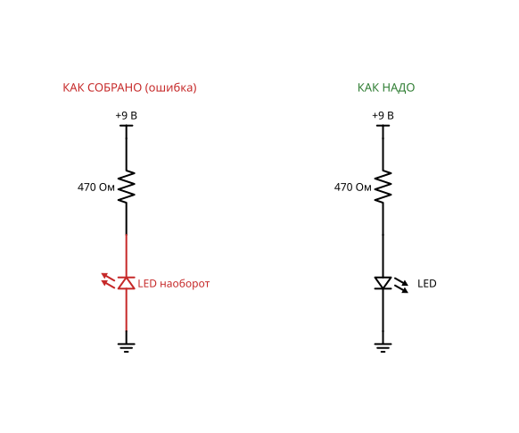
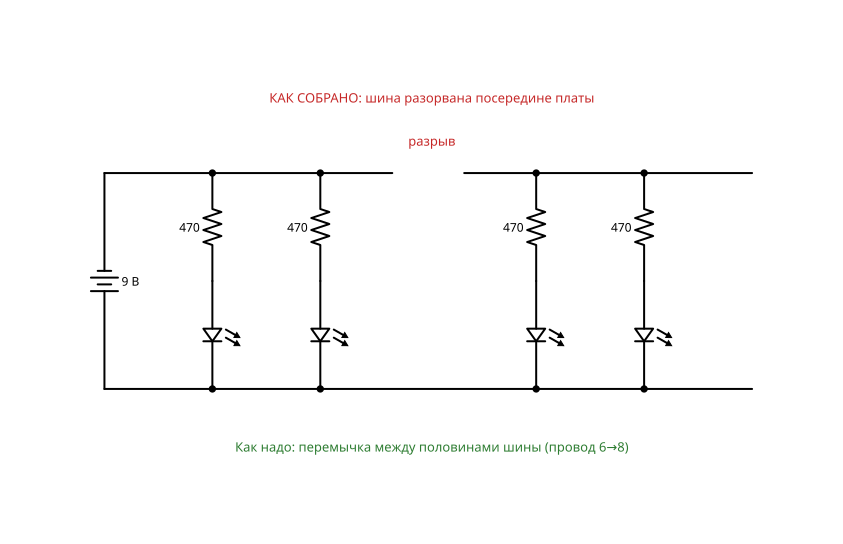
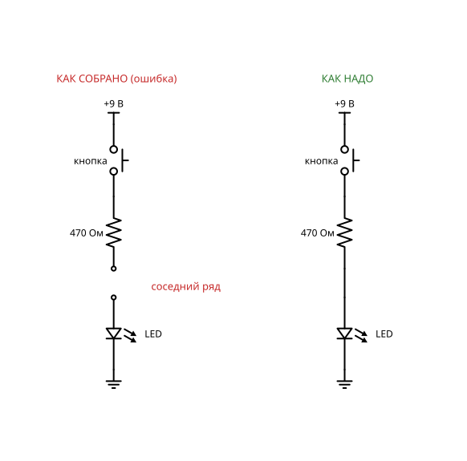
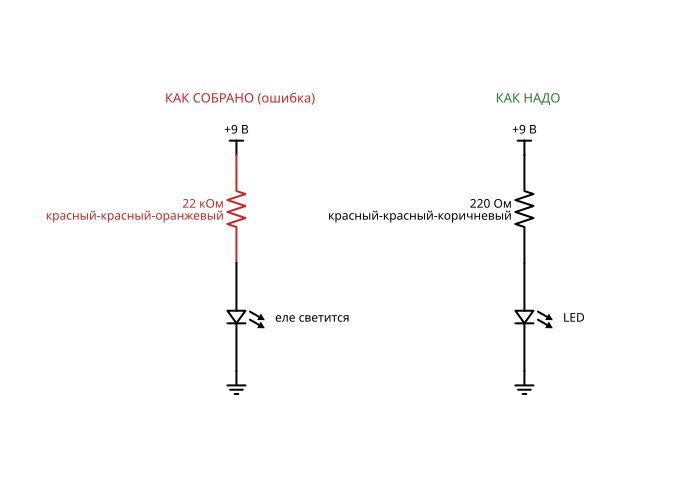
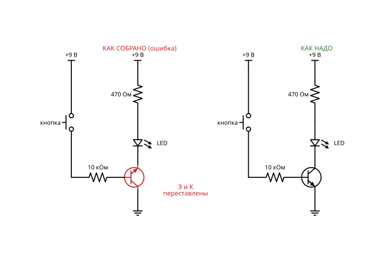
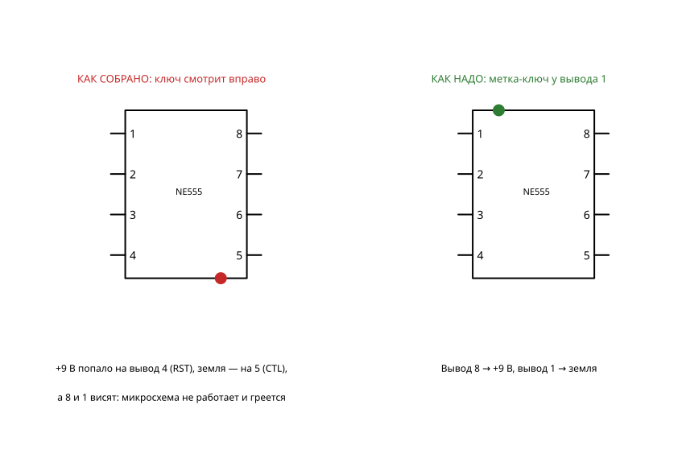
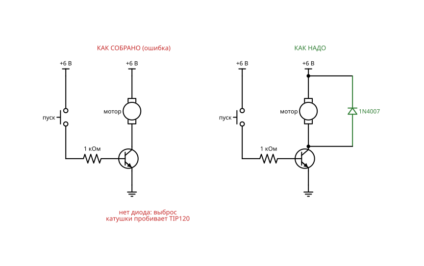
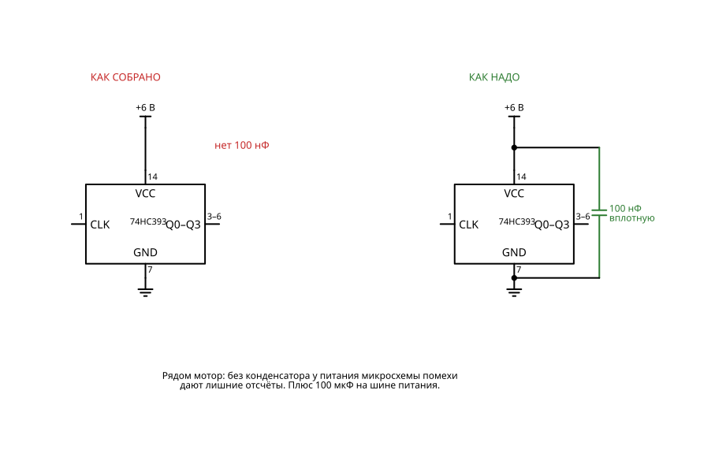
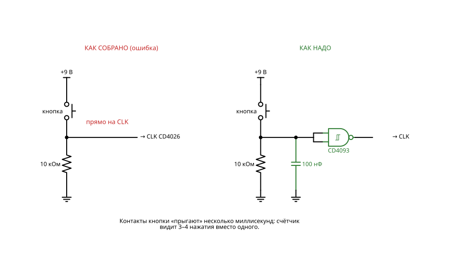
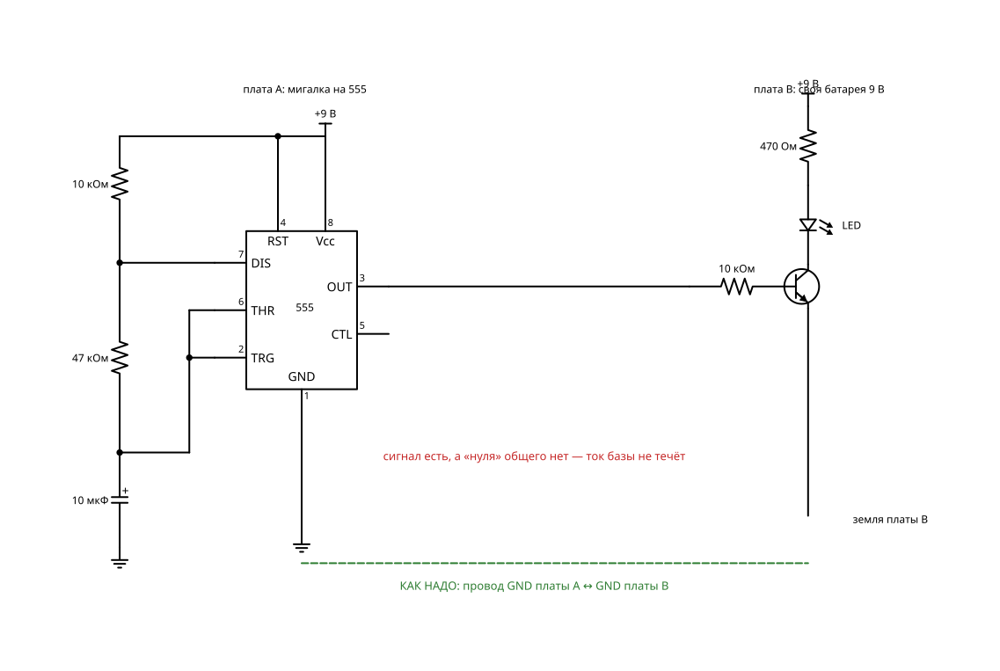

# Найди ошибку

Отдельный режим: игроку дают готовую сборку из любого отдела, которая не работает. Ошибки — те, на которых новички реально спотыкаются вживую.

Схем в разделе: **12**. Уровни сложности: 1, 2, 3, 4, 5.

Общие правила, обозначения и базовый набор (бредборд, перемычки) — в `README.md`.

## Сводная BOM раздела

Максимальное количество каждой детали, нужное для любой одной схемы раздела. Если собирать схемы по очереди и переиспользовать детали, этого набора хватит на весь раздел.

| Кол-во | Компонент |
|---:|---|
| 1 | Батарейный отсек 3×AA (4,5 В) |
| 1 | Батарейный отсек 4×AA (6 В) |
| 2 | Батарея 9 В «Крона» + клипса |
| 1 | Таймер NE555 |
| 1 | CD4026 (счётчик с дешифратором 7-сегм.) |
| 1 | CD4093 (4× И-НЕ с триггером Шмитта) |
| 1 | 74HC00 (4× И-НЕ) |
| 1 | 74HC393 (2× 4-бит счётчик) |
| 1 | Резистор 1 кОм |
| 2 | Резистор 10 кОм |
| 1 | Резистор 22 кОм |
| 1 | Резистор 220 Ом |
| 4 | Резистор 330 Ом |
| 1 | Резистор 47 кОм |
| 7 | Резистор 470 Ом |
| 1 | Конденсатор керамический 10 нФ |
| 1 | Конденсатор керамический 100 нФ |
| 1 | Конденсатор электролитический 10 мкФ |
| 1 | Конденсатор электролитический 100 мкФ |
| 1 | Диод 1N4007 |
| 1 | Транзистор NPN BC547 (или 2N3904) |
| 1 | Транзистор NPN Дарлингтон TIP120 |
| 4 | LED красный 5 мм |
| 1 | Индикатор 7-сегментный 0,56″, общий катод |
| 1 | Кнопка тактовая 6×6 |
| 1 | Мотор DC 3–6 В |
| 1 | Провод связи между платами |

## Схемы

### 1. Перевёрнутый светодиод

**Что это и зачем:** Всё собрано правильно, кроме полярности одной детали.

**Игрок видит:** тёмный LED и должен найти, почему.

**Заметка для реализации:** Основа: «Светодиод с резистором». Ошибка: LED установлен катодом к плюсу.

**Принципиальная схема:**

**BOM:**

| Кол-во | Компонент |
|---:|---|
| 1 | Батарея 9 В «Крона» + клипса |
| 1 | Резистор 470 Ом |
| 1 | LED красный 5 мм |

### 2. Разорванная шина питания

**Сложность:** Уровень 1

**Что это и зачем:** На длинной плате шина разделена посередине, и половина схемы без питания.

**Игрок видит:** работающую левую половину и мёртвую правую.

**Заметка для реализации:** Основа: четыре LED вдоль всей платы. Ошибка: шины на плате 830 разделены посередине, перемычки нет.

**Принципиальная схема:**

**BOM:**

| Кол-во | Компонент |
|---:|---|
| 1 | Батарея 9 В «Крона» + клипса |
| 4 | Резистор 470 Ом |
| 4 | LED красный 5 мм |

### 3. Не тот ряд

**Сложность:** Уровень 1

**Что это и зачем:** Ножка стоит на соседнем ряду, соединения нет.

**Игрок видит:** подсветку рядов, где одной связи не хватает.

**Заметка для реализации:** Основа: «Кнопка и выключатель». Ошибка: вывод резистора стоит на соседнем ряду.

**Принципиальная схема:**

**BOM:**

| Кол-во | Компонент |
|---:|---|
| 1 | Батарея 9 В «Крона» + клипса |
| 1 | Кнопка тактовая 6×6 |
| 1 | Резистор 470 Ом |
| 1 | LED красный 5 мм |

### 4. Перепутанные полосы

**Сложность:** Уровень 2

**Что это и зачем:** Вместо 220 Ом стоит 22 кОм: LED еле светится.

**Игрок видит:** тусклый LED и должен прочитать маркировку.

**Заметка для реализации:** Ошибка: стоит 22 кОм (красный-красный-оранжевый) вместо 220 Ом (красный-красный-коричневый). 220 Ом — деталь для замены.

**Принципиальная схема:**

**BOM:**

| Кол-во | Компонент |
|---:|---|
| 1 | Батарея 9 В «Крона» + клипса |
| 1 | Резистор 22 кОм |
| 1 | Резистор 220 Ом |
| 1 | LED красный 5 мм |

### 5. Транзистор не той ножкой

**Сложность:** Уровень 2

**Что это и зачем:** Перепутаны эмиттер и коллектор, ключ работает плохо или никак.

**Игрок видит:** почти не работающую схему и распиновку, которую надо сверить.

**Заметка для реализации:** Основа: «Транзисторный ключ». Ошибка: эмиттер и коллектор переставлены (инверсный режим, почти не работает).

**Принципиальная схема:**

**BOM:**

| Кол-во | Компонент |
|---:|---|
| 1 | Батарея 9 В «Крона» + клипса |
| 1 | Транзистор NPN BC547 (или 2N3904) |
| 1 | Кнопка тактовая 6×6 |
| 1 | Резистор 10 кОм |
| 1 | Резистор 470 Ом |
| 1 | LED красный 5 мм |

### 6. Перевёрнутая микросхема

**Сложность:** Уровень 3

**Что это и зачем:** Ключ на корпусе смотрит не туда. Микросхема греется.

**Игрок видит:** индикатор перегрева на корпусе.

**Заметка для реализации:** Основа: «Мигалка на 555». Ошибка: микросхема развёрнута на 180°. Вживую не повторять долго — греется.

**Принципиальная схема:**

**BOM:**

| Кол-во | Компонент |
|---:|---|
| 1 | Батарея 9 В «Крона» + клипса |
| 1 | Таймер NE555 |
| 1 | Резистор 10 кОм |
| 1 | Резистор 47 кОм |
| 1 | Конденсатор электролитический 10 мкФ |
| 1 | Конденсатор керамический 10 нФ |
| 1 | Резистор 470 Ом |
| 1 | LED красный 5 мм |

### 7. Висящий вход

**Сложность:** Уровень 3

**Что это и зачем:** Неподключённый вход КМОП ловит наводки, LED мигает сам по себе.

**Игрок видит:** случайное поведение, которое прекращается, если коснуться схемы.

**Заметка для реализации:** Ошибка: второй вход вентиля не подключён. Решение — подтяжка 10 кОм.

**Принципиальная схема:**

**BOM:**

| Кол-во | Компонент |
|---:|---|
| 1 | Батарейный отсек 3×AA (4,5 В) |
| 1 | 74HC00 (4× И-НЕ) |
| 1 | Резистор 330 Ом |
| 1 | LED красный 5 мм |
| 1 | Резистор 10 кОм |

### 8. Забытый диод у мотора

**Сложность:** Уровень 3

**Что это и зачем:** Выброс от катушки раз за разом убивает транзистор.

**Игрок видит:** схему, которая работает пару секунд и сгорает.

**Заметка для реализации:** Основа: «Мотор через транзистор». Ошибка: нет обратного диода. 1N4007 — деталь для решения.

**Принципиальная схема:**

**BOM:**

| Кол-во | Компонент |
|---:|---|
| 1 | Батарейный отсек 4×AA (6 В) |
| 1 | Транзистор NPN Дарлингтон TIP120 |
| 1 | Резистор 1 кОм |
| 1 | Кнопка тактовая 6×6 |
| 1 | Мотор DC 3–6 В |
| 1 | Диод 1N4007 |

### 9. Нет блокировочного конденсатора

**Сложность:** Уровень 4

**Что это и зачем:** Счётчик иногда сбивается, когда включается мотор или пищалка.

**Игрок видит:** случайные лишние отсчёты и помехи на осциллографе.

**Заметка для реализации:** Ошибка: нет 100 нФ у питания 74HC393 и 100 мкФ на шине; помехи от мотора дают лишние отсчёты.

**Принципиальная схема:**

**BOM:**

| Кол-во | Компонент |
|---:|---|
| 1 | Батарейный отсек 4×AA (6 В) |
| 1 | Таймер NE555 |
| 1 | 74HC393 (2× 4-бит счётчик) |
| 4 | LED красный 5 мм |
| 4 | Резистор 330 Ом |
| 1 | Транзистор NPN Дарлингтон TIP120 |
| 1 | Диод 1N4007 |
| 1 | Мотор DC 3–6 В |
| 1 | Резистор 1 кОм |
| 1 | Резистор 10 кОм |
| 1 | Конденсатор электролитический 10 мкФ |
| 1 | Конденсатор керамический 10 нФ |
| 1 | Конденсатор керамический 100 нФ |
| 1 | Конденсатор электролитический 100 мкФ |

### 10. Дребезг кнопки

**Сложность:** Уровень 4

**Что это и зачем:** Одно нажатие прибавляет три-четыре единицы.

**Игрок видит:** счётчик прыгает через числа.

**Заметка для реализации:** Ошибка: кнопка идёт на тактовый вход напрямую. CD4093 и 100 нФ — детали для решения.

**Принципиальная схема:**

**BOM:**

| Кол-во | Компонент |
|---:|---|
| 1 | Батарея 9 В «Крона» + клипса |
| 1 | CD4026 (счётчик с дешифратором 7-сегм.) |
| 1 | Индикатор 7-сегментный 0,56″, общий катод |
| 7 | Резистор 470 Ом |
| 1 | Кнопка тактовая 6×6 |
| 1 | Резистор 10 кОм |
| 1 | CD4093 (4× И-НЕ с триггером Шмитта) |
| 1 | Конденсатор керамический 100 нФ |

### 11. Нет общей земли

**Сложность:** Уровень 4

**Что это и зачем:** Две платы с разным питанием соединены сигналом, но не землёй.

**Игрок видит:** сигнал, который «не доходит», хотя провод есть.

**Заметка для реализации:** Основа: мигалка на 555 на одной плате управляет транзистором на другой. Ошибка: нет провода GND–GND.

**Принципиальная схема:**

**BOM:**

| Кол-во | Компонент |
|---:|---|
| 2 | Батарея 9 В «Крона» + клипса |
| 1 | Таймер NE555 |
| 2 | Резистор 10 кОм |
| 1 | Резистор 47 кОм |
| 1 | Конденсатор электролитический 10 мкФ |
| 1 | Конденсатор керамический 10 нФ |
| 1 | Транзистор NPN BC547 (или 2N3904) |
| 1 | Резистор 470 Ом |
| 1 | LED красный 5 мм |
| 1 | Провод связи между платами |

### 12. Сломанный проект

**Сложность:** Уровень 5, финальный проект

**Что это и зачем:** Большая схема из уровня 5 с двумя-тремя ошибками одновременно. Нужен пробник, осциллограф и терпение.

**Игрок видит:** почти работающее устройство и должен найти все неисправности.

**Заметка для реализации:** Базовая схема — любой проект уровня 5; в неё вносятся 2–3 ошибки из этого раздела.

**Принципиальная схема:**

**BOM:**

| Кол-во | Компонент |
|---:|---|
| 1 | Состав как у «Цифровые часы» (Уровень 5) |
